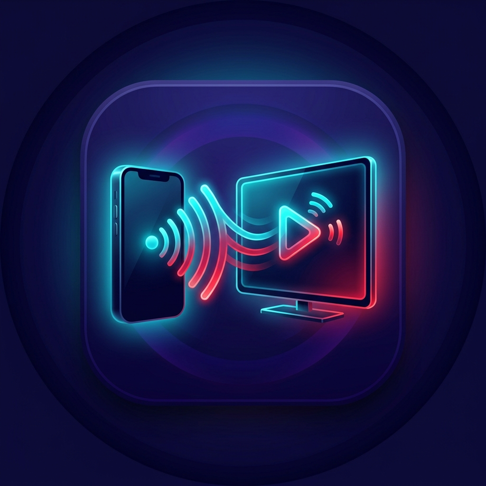

# Simple Cast - Universal Android TV & LG TV Cast App (v2.1)



**Simple Cast** е съвременно, високопроизводително Android приложение, разработено на **Kotlin + Jetpack Compose**, предназначено за предаване на уеб видеа, локална галерия, IPTV канали и екранно огледало към **LG webOS TV, Android TV, Google TV, Sony, Samsung Tizen, TCL, Xiaomi TV Box и Chromecast**.

---

## 🚀 Какво е новото във версия v2.1

* 📺 **Универсална поддръжка за Android TV & Google TV**: Добавени са универсални DLNA SOAP протоколи (`http-get:*:video/mp4:*` и `http-get:*:*:*`), които премахват грешката *"Format Not Supported"* при Android TV плейъри.
* 🛡️ **Anti-AdBlock Defuser**: Автоматично трикване на анти-адблок скриптове (`ads.js`, `adblock.js`, `fuckadblock`) и премахване на блокиращите модални прозорци в уеб браузъра, запазвайки рекламния филтър активен.
* 📺 **Вграден IPTV Web Portal (`/iptv`)**: Локален уеб портал, отварящ се с 1 клик през бутона **Free IPTV**. Интерактивна търсачка и списък с канали от плейлисти (напр. `iptv.org.ua`), 1-tap кастване и вграден HLS плейър.
* 🔋 **MediaPlaybackService (Doze Mode Protection)**: Фона услуга с `WakeLock` & `WifiLock`, която предотвратява заспиването на Wi-Fi модула и процесора при изключен/заключен екран на телефона.
* 🔍 **Умна адресна лента**: С `(X) Clear` бутон за бързо изчистване, автоматично Google търсене за въведени думи и фокус защита.
* 🍪 **HTTPS Reverse Proxy & Cookie Forwarding**: Автоматично конвертиране на HTTPS HLS/MP4 стриймове към HTTP за телевизори и предаване на бисквитки (`Cookies`) и `Referer` хедъри за защитени уеб потоци.

---

## 🌟 Основни Модули и Функционалности

### 1. 🖼️ Local Gallery Cast
* **SSDP Multicast Discovery**: Автоматично открива налични телевизори в същата Wi-Fi мрежа (UDP 239.255.255.250:1900).
* **Local HTTP Server**: Вграден NanoHTTPD сървър (`http://<PHONE_IP>:8080/media/<id>`) с поддръжка за HTTP Range (bytes=X-Y) за стрийминг на снимки и видеа от телефона.
* **Правилна ориентация**: Видеата от галерията се предават с правилно съотношение на страните без завъртане.

### 2. 🌐 Web Video Cast (Media Sniffer + Anti-AdBlock)
* **Media Sniffer**: Автоматично прихваща `.m3u8`, `.mp4`, `.mpd`, `.webm` видео адреси от уеб страници.
* **Ad Blocker & Anti-AdBlock Defuser**: Блокира рекламни домейни и изчиства анти-адблок банерите.
* **HTTPS Proxy & HLS Rewriter**: Пренаписва сегментите на `.m3u8` манифестите през локалния сървър за телевизори, които не поддържат HTTPS DLNA.

### 3. 📺 Free IPTV Web Portal
* Достъп с един бутон (**Free IPTV**) до интерактивен каталог с канали и филми.
* Вградена бърза търсачка по заглавие и категория.
* Вграден плейър за преглед на телефона + директен бутон **▶ Play & Cast Stream** към телевизора.

### 4. 📱 Screen Share (Screen Mirroring)
* **MediaProjection API**: Заснемане на екрана и звука на телефона в реално време (Foreground Service).
* **Miracast / Screen Share**: Бърз достъп до системните настройки за безжичен дисплей (`Settings.ACTION_CAST_SETTINGS`).

### 5. 🎨 Jetpack Compose UI
* Модерен тъмен интерфейс с LG Velvet Red & Neon Cyan акценти.
* Заключена вертикална ориентация (Portrait mode) за максимално удобство.
* Активен контролен мини-плейър (Play/Pause/Stop/Disconnect).

---

## 📥 Изтегляне (Download APK)

Можете да изтеглите готовата компилирана версия директно от репозиторито:
* 📦 **[SimpleCast-v2.1-debug.apk](SimpleCast-v2.1-debug.apk)**

---

## 🛠️ Сглобяване от сорс код (Build & Run)

```bash
# Клониране на хранилището
git clone https://github.com/Stoyan377/SimpleCast.git
cd SimpleCast

# Сглобяване на debug APK с Gradle
./gradlew assembleDebug
```

Сглобеният APK файл се създава в `app/build/outputs/apk/debug/app-debug.apk`.
